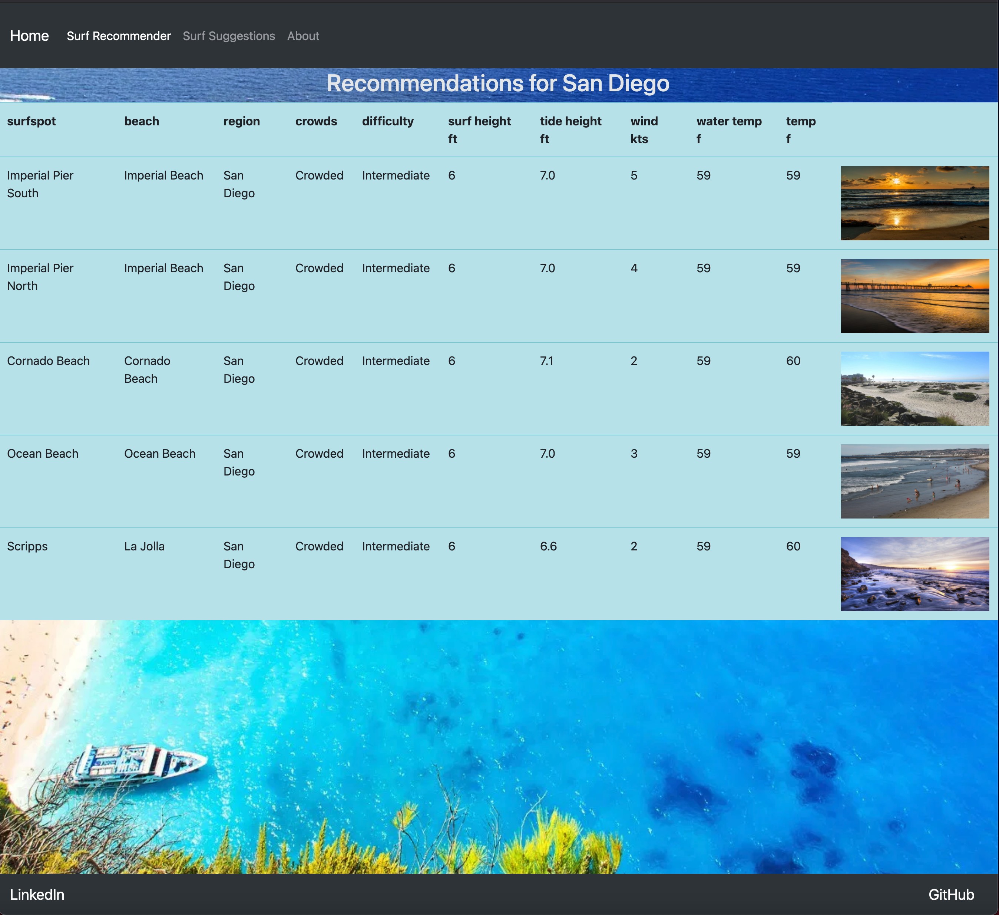
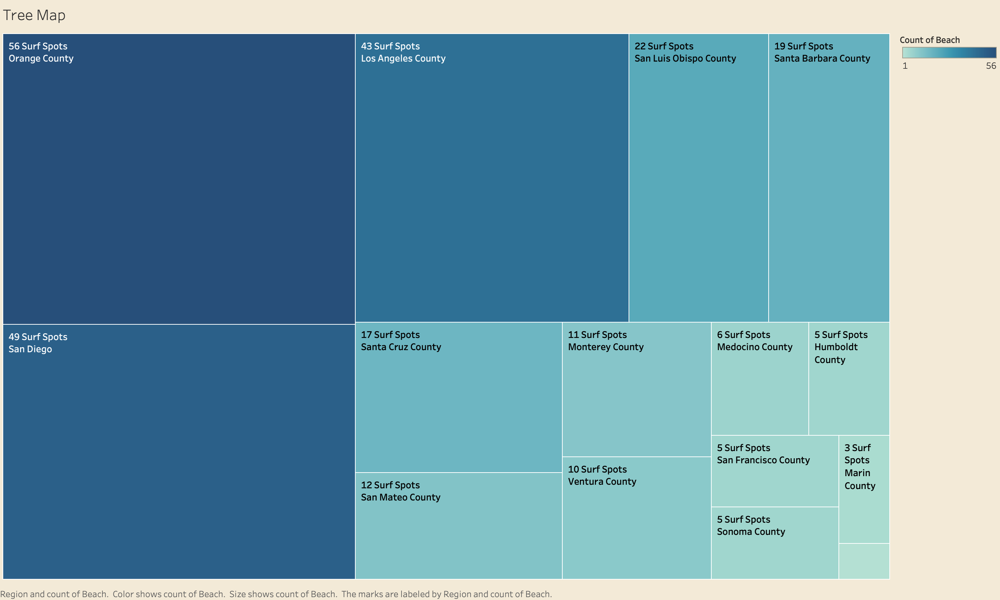
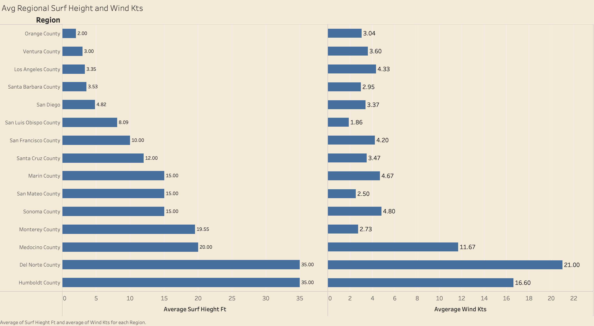

# Surfs Up

## Surf Recommender for California Surf Spots

#### Presentation Slides:
https://www.canva.com/design/DAETCwoFg1o/share/preview?token=I5XNwnLgGbJpai8ZZQ3aWQ&role=EDITOR&utm_content=DAETCwoFg1o&utm_campaign=designshare&utm_medium=link&utm_source=sharebutton

## Table of Contents
1. [Background](#background)
2. [Web Application](#web-application)
3. [Data Gathering Process](#data-gathering-process)
4. [Technologies Used](#technologies-used)
5. [Future Steps](#future-steps)

## Background

When I lived in San Diego, I enjoyed going surfing on my days off. The issue that I kept finding myself in is that I went to the same five breaks, even though California has over 250 surf spots. At the time the surfing forecast applications I used did not provide any useful recommenders that could give me locations that I could visit. There also was not a way to distinguish these breaks based on difficulty of the surf. I decided to make this recommender to help people find other Surf locations that may become their new favorite location.

## Web Application 

Users are given two options to select from on the Home page. They can select the Surf Recommender or the Surf Suggester  which will provide you two different sets of locations.

The User is given two options to select from on this page. Your first selection would be the county of your favorite Surf Spot.

The Second option would be the Surf Spot itself.

The User is then given the current conditions of their selected Surf location, and the top five similar Surf locations to the selected location. This is accomplished by getting the cosine similarity of the conditions.

For instances where the User has never surfed in California or in San Diego in general, I made a Surf Suggestion  Page.

This page takes 3 options.

1. The County where you will be Surfing.
2. Your Experience Level
3. If you want a Crowded Surf Spot or not.

Unlike the previous recommender this one utilizes filter-based suggestion with the choices the users selected.

I also included images of each Surf Spot, so that the User can make a selection based on appearance  and familiarize themselves with the Surf Spot.

## Data Gathering Process

I gathered by Web Scraping Surfline.com and Surf-Report.Com. Web Scraping is a automated process that retrieves information from a site. I gathered values including **Surf Height, Tide Height, Wind, Water Temp, Outdoor Temp, Difficulty, and Crowdedness** for 264 Surf Locations. I utilized Beautiful Soup, and Pandas for this process.

This Tree Map displays the spread of Surf Spot by County. 

This Horizontal Bar Plot gives a look at the avg conditions for the Counties on Jan 13 2021. As you can see, different counties have very different conditions.

## Technologies Used

I utilized Excel and Beautiful Soup for the Data Gathering Process.

Leveraged Jupyter Notebooks for my IDE, Visual Studios for my web app and python libraries  for my data processing.

I deployed the Web App utilizing Flask, HTML, and BootStrap 5.

## Future Steps

- I will like to add additional places to my web app i.e Hawaii.

- I will like to deploy this website utilizing Google Cloud or AWS Lambda. Also set up a Cron Job to further automate the webscraping.

- Lastly, I will like to include a User rating system for the surf locations so that I can create a Collabrative Recommender System.

